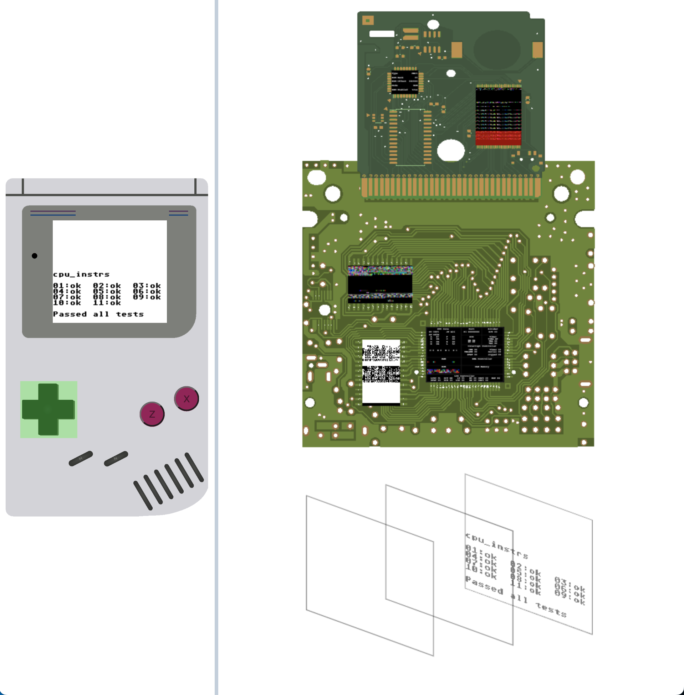

# GameBoy Emulator
Note that some roms may not work (eg: SML)



A gameboy emulator based on all the other emulators online.
<br>
It has a fancy debugger that allows viewing the "internals" of the gameboy.

[Live link](https://aifanatic.github.io/gameboy-emulator/dist/index.html)

## Run
```bash
yarn dev

# Serve the dist folder
python3 -m http.server --directory dist

# Browse http://localhost:8000
open http://localhost:8000

# To load a rom
open http://localhost:8000/?rom=./rom/path.gb
```